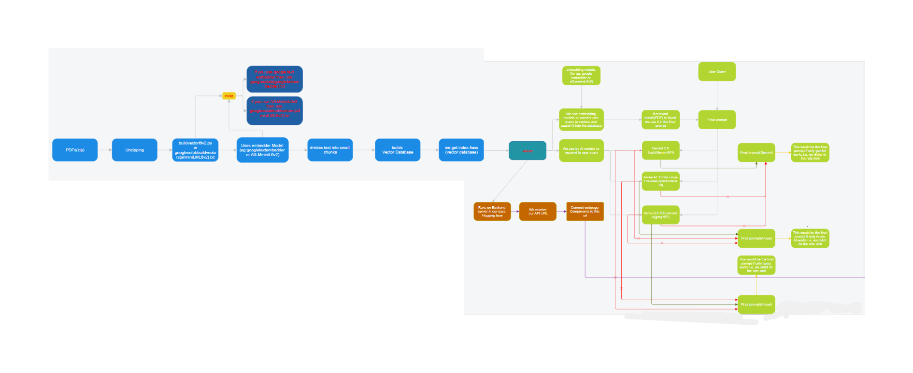

# Explore Singapore
### *Legal, Historical, and Infrastructural Knowledge Engine*

[](https://www.python.org/)
[](https://flask.palletsprojects.com/)
[](https://python.langchain.com/)
[](https://github.com/facebookresearch/faiss)
[](https://huggingface.co/)


## 📌 Project Overview
The **Singapore Intelligence RAG System** is an intelligent platform that utilizes AI technology to deliver accurate and relevant information about the legal system, policies, and historical events of Singapore, as well as its critical infrastructure.

Unlike other LLMs, which have the tendency to "hallucinate" facts, the Singapore Intelligence RAG System employs **Retrieval-Augmented Generation (RAG)**. It relies on a carefully curated set of Singaporean data (more than 33,000 pages of PDFs) to ensure that all answers are based on factual reality.


---

## 🏗 System Architecture
The system follows a high-performance RAG pipeline optimized for low-resource environments:

1.  **Ingestion:** Processed 33,000+ pages of Singaporean legal and historical documents.
2.  **Vectorization:** Used `BGE-M3` to create 1024-dimensional semantic embeddings.
3.  **Retrieval:** Implemented **FAISS (Facebook AI Similarity Search)** for millisecond-latency vector lookups.
4.  **Generation:** A "Triple-Failover" logic ensures 99.9% uptime.

---

## 🚀 Key Features

### **1. Triple-AI Failover Backend**
For reliability in demos and heavy traffic, the system establishes a robust chain of command for LLM inference as follows:

## Primary: Google Gemini 2.0 Flash (Fastest, High Context)
## Secondary: Llama 3.3 70B via OpenRouter (Robust fallback)
## Tertiary: Llama 3.3 70B via Groq (Emergency fallback)

### **2. "Lquid-Glass" Interactive UI**
The frontend interface is a custom-built **Framer Code Component** (React + Framer Motion).
* **Glassmorphism:** Real-time backdrop blur (`backdrop-filter: blur(25px)`).
* **Spring Physics:** Smooth sideways expansion on hover.
* **Minimalist Design:** SVG iconography and San Francisco typography.

### **3. Local Embedding Inference**
Rather than using API calls for vectorization (which incurs latency and expense), the embedding model is executed locally within the application container for privacy and performance.
---

## 🛠 Tech Stack

| Component | Technology | Description |
| :--- | :--- | :--- |
| **Frontend** | React, Framer Motion | Interactive "Ask AI" widget. |
| **Backend** | Flask, Gunicorn | REST API handling RAG logic. |
| **Vector DB** | FAISS (CPU) | Local, high-speed similarity search. |
| **Embeddings** | Sentence-Transformers | `BGE-M3` (Local(server based)). |
| **LLMs** | Gemini 2.5 flash, Llama 3.3 | Text generation and synthesis. |
| **Deployment** | Hugging Face Spaces | Docker-based cloud hosting. |

---

## ⚙️ Installation & Local Setup

## **Prerequisites**
### Very Important Install this In the backend Server before executing any Python files in the server.

* flask
* flask-cors
* python-dotenv
* google-generativeai
* google-genai
* langchain
* langchain-google-genai
* langchain-community
* langchain-huggingface
* faiss-cpu
* sentence-transformers
* pypdf
* tiktoken
* numpy
* gunicorn
* setuptools
* wheel
* scikit-learn
* openai



### **1. Clone the Repository**
```bash
git clone [git clone https://github.com/adityaprasad-sudo/Explore-Singapore.git)
